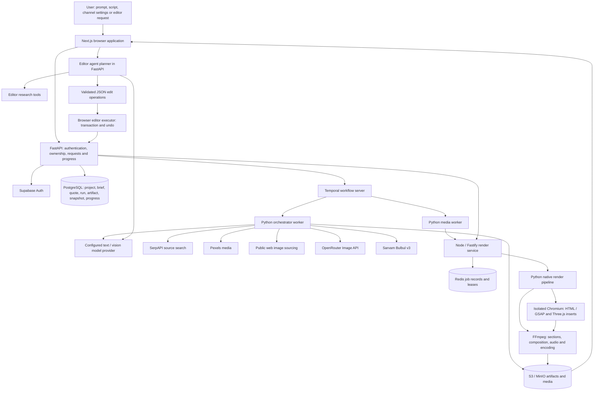
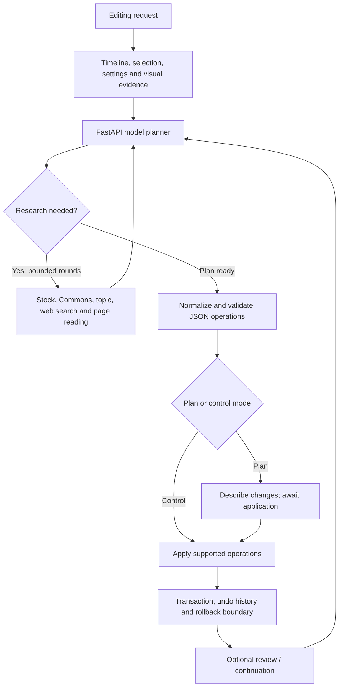

# SkyClip / HANUMAN — Current AI Agent Architecture

Code and selected running-container configuration inspected on 4 October 2026. This describes the implementation currently present, not a proposed architecture or a claim that every provider/model has been benchmarked.

## 1. What the system actually contains

There are two main AI paths: (1) video generation coordinated by Temporal and (2) an interactive editor agent. Generation stages perform research, writing, language conversion, visual planning and template adaptation. These are role-specific model calls and activities, not independently deployed conversational agents. TTS, rendering, persistence and validation are supporting services rather than reasoning agents.

Codex development subagents are separate from the product. Names such as press_sfx or engine_export belong to development work; users' video requests do not invoke those Codex chats.

## 2. Complete system diagram

The API-to-render arrow also covers template-preview jobs and render API paths. Normal generation first creates an editable timeline. Final export is a separate rendering workflow.

## 3. Agent and role inventory

| Role | Implementation | Input | Output | Reasoning or deterministic? |
|---|---|---|---|---|
| Brief intake | validate_brief; quote inference | Prompt/script, duration, language, format, channel defaults | Validated run context / quote | Primarily validation and rules; quote inference explicitly has no LLM |
| Research | run_research | Topic, blocked sources | research.json: summary, facts and sources | Search plus text-model summarization |
| Scriptwriter | generate_script | Research, brief, language, target length | script.json with sections and narration | Model calls, duration estimation, chunking and extension passes |
| Script-first parser | parse_script | User-supplied script | Structured sections | Script-processing path; research stage is skipped |
| Language conversion | language_text.convert_texts | Narration or captions, chosen language/script | Translated narration or Latin transliteration | Text model plus script checks |
| Narration | generate_voice | Narration, speaker, language | WAV audio, measured durations and TTS-piece clocks | Sarvam TTS; not an autonomous agent |
| Visual planner | plan_scenes | Sections, narration, sourcing policy | scenes.json and media assets | Model-derived scene queries plus deterministic sourcing/ranking |
| Template adapter | adapt_uploaded_templates | Enabled template catalog and selected scene facts | Selected template and editable text bindings | Text-model selection/adaptation; animation code is preserved |
| Timeline builder | build_timeline | Script, audio timings, media, treatments | timeline.json | Mainly deterministic assembly; includes the template-adaptation call |
| Editor agent | plan_editor_ops + runEditorAgent | User request, timeline, selections, visual evidence | JSON operations and application results | Model planning, bounded research, validation and execution |
| Visual inspection | editor visual evidence and vision calls | Relevant frames and image references | Evidence for the editor planner | Vision model where needed; not continuous full-video analysis |
| Renderer | VideoRenderWorkflow + render_video + render service | Latest timeline manifest | Final MP4 and progress | Deterministic media processing; no LLM needed to encode frames |

These labels explain responsibilities. They are not twelve separate agent servers or twelve separately trained models.

## 4. Generation workflow

```mermaid
flowchart LR
    A[Prompt and channel settings] --> B[Validate brief]
    B --> C{Entry path}
    C -->|Prompt-first| D[Research]
    D --> E[Generate script]
    C -->|Script-first| F[Parse supplied script]
    E --> G[Generate voice and measure audio]
    F --> G
    G --> H[Plan scenes and obtain media]
    H --> I[Build timeline and captions]
    I --> J[Select and adapt enabled templates]
    J --> K[Complete timeline: editor ready]
    K --> L[User requests render]
    L --> M[VideoRenderWorkflow]
    M --> N[Final MP4]
```

- Channel preferences are included in the generation request: narration language, caption script, voice, duration, sourcing policy, image model, built-in motion preferences and uploaded templates.
- The workflow executes the major stages sequentially. Bounded parallelism exists inside voice generation and scene fetching; the entire pipeline is not all-parallel.
- Research uses up to six Google search results through SerpAPI, retaining titles, URLs and snippets. It is not an exhaustive crawler or a full-paper research agent. Without source excerpts, the research prompt requests unverified background rather than invented citations.
- Scriptwriting estimates spoken duration and performs additional passes when necessary. Actual narration duration subsequently determines scene timing.
- Voice synthesis uses Sarvam. Measured TTS pieces are saved so caption timing follows the generated audio.
- Scene sourcing can use Pexels, public web images or the image-generation API according to channel settings. Metadata relevance scoring is deterministic token matching, not comprehensive visual verification of every asset.
- Captions can preserve narration language while displaying Latin/English letters. This is transliteration, not necessarily translation into English.
- Captions are split using TTS-piece duration and punctuation/word weights. This is not forced alignment or speech recognition.
- Timeline assembly combines main video, B-roll, narration, captions, music, transitions, graphics and settings. Background music beds and shipped SFX are procedural/prebuilt assets, not generative-audio model output.

## 5. Editor agent architecture

The frontend collects structured timeline context and selected visual evidence. The backend chooses the configured/selected model. If a text-only model is selected and images need inspection, an available vision model can analyze them first.

The planner can request search_stock, search_commons, read_topic, search_web and read_web_page. It permits up to three research rounds, with at most three requests per round. Public-page reading has URL/DNS restrictions and size limits. Retrieved text is evidence, not instructions.

Supported editor operations include moving/trimming/deleting clips; replacing media; adding/editing captions and text; transforms and fit modes; transitions; audio gain, fades and muting; graphics, keyframes and motion scenes; motion-template edits; supported Three.js scene data; image-background removal; selection/playhead operations; and undo/redo.

Both backend and frontend validate operations. Validation checks IDs, locked items, allowed fields, values, timing and schemas. The browser applies edits through its editor store. This is an important ownership boundary: the model returns a plan, rather than unrestricted commands against the application database.

Plan mode can expose an application/approval action. Control mode applies a validated plan. Optional verification can continue for up to six steps. A rejected frontend plan has one corrective retry. These bounded loops are not an unlimited agent swarm.

The editor planner explicitly excludes new voice synthesis, audio beat detection, silence detection and rendering as agent tools. It can modify existing audio. Rendering is requested through a separate application path.

## 6. Uploaded motion-template lifecycle

Upload accepts the project's JSON template format, not an arbitrary MP4 as editable animation code. A template contains ID, name, description, tags, HTML, CSS, GSAP-producing JavaScript, duration, asset definitions, optional audio cues and an AI-use flag.

The UI can annotate plain textual leaves as editable bindings and normalizes the supplied reference's fixed counter into scene data. The generation adapter rewrites declared slots using scene facts. It does not retrain a model or freely rewrite all animation logic. Non-bound logic remains template-authored.

Templates are stored in user-scoped object storage. Channel/template selections also live in the browser's persisted profile store. Preview URLs are refreshed using authenticated API calls. Preview ownership is checked; one user cannot retrieve another user's render through this endpoint.

Built-in Press Cutout placement uses a heuristic shortlist with up to three inserts, separated by at least a minute. Uploaded-template adaptation operates on that shortlist and can choose no template. This is not unconstrained AI evaluation of every frame in the whole video.

HTML/GSAP preview runs in an opaque iframe sandbox. Cloud capture uses an isolated browser context with blocked external requests. Media is staged/embedded before capture. The renderer seeks a paused timeline at explicit video timestamps. Existing animation is stretched/compressed to the inserted clip duration.

## 7. Rendering architecture

1. The API/workflow loads the latest manifest and validates it.
2. The media worker resolves cloud or local rendering.
3. The render service queues jobs, records status in Redis, claims leases and starts a Python rendering process.
4. The native pipeline prepares HTML/GSAP inserts and Three.js scenes using Chromium capture. It preserves trim/source clocks and caches generated clips.
5. Ordinary media sections use FFmpeg rather than requiring browser capture for every frame.
6. Sections can render with bounded concurrency. Cache entries reuse unchanged sections/scene renders.
7. Audio mixing combines narration, footage audio, music and SFX, with gain, fades, ducking and limiting.
8. FFmpeg assembles the final MP4, uploads it and exposes an authenticated/downloadable result.

The timeline manifest is the shared contract between preview, editing and export. Three.js currently consumes constrained declarative scene data: supported primitive geometry, camera settings, material properties, transforms and keyframes. It is not general support for arbitrary Three.js application code, shaders or external 3D models.

Encoder configuration is auto; code supports NVIDIA h264_nvenc and software libx264. GPU selection depends on runtime hardware/FFmpeg capability. A GPU does not eliminate HTML frame-capture costs, and a single short-template benchmark does not establish long-video throughput.

## 8. State, artifacts and reliability

| Component | Responsibility |
|---|---|
| PostgreSQL | Users, projects, briefs, quotes, generation runs, artifact references, timeline snapshots and progress events |
| Temporal | Workflow history, scheduling, stage retries, heartbeat supervision and cross-worker task queues |
| Redis | Render job records, active-job tracking, capacity/leases and recovery coordination |
| S3 / MinIO | Research/script/scenes/timeline JSON, media, audio, templates and final MP4s |
| Browser persisted stores | Channel profiles/template selections and editor interaction state |
| Render cache volume | Reusable HTML/Three.js captures and native render sections |

Generation activities generally allow three attempts. Long activities heartbeat and have duration-scaled timeouts. Render workflows permit two activity attempts, with fatal render errors excluded from retry. The render service also has its own job retry/recovery logic; these are separate layers.

Activity checkpoints preserve expensive completed work. Progress flows from workers through internal API endpoints into stored project/run events. Internal calls and render-service calls use their own configured credentials; user API calls enforce authentication and project ownership.

There is no general long-term conversational memory shared among independent AI agents. Current state is structured run context, saved artifacts, timeline snapshots and the editor conversation/context passed with requests.

## 9. Selected running configuration

Read from selected active containers during this inspection:

- Orchestrator stub mode: false.
- Configured text model identifier: gemini-3.5-flash-lite.
- Configured text provider endpoint: Google's OpenAI-compatible endpoint. The client/module remains named OpenRouter, but this configured text traffic targets Google.
- Separate image-generation client: OpenRouter Image API, when enabled/configured.
- Narration model: bulbul:v3.
- Orchestrator concurrent activities: 2.
- Render service concurrent jobs: 1.
- Encoder: auto.
- Editor fast/smart/vision model overrides: empty; selection falls back to configured defaults and discovered model capabilities.

This reports configuration strings and selected limits, not a successful provider-availability check for every model or the exact model used in every historical request.

## 10. Current limits and missing agents

- No separately trained or fine-tuned SkyClip model was found in these paths. They call external pretrained providers.
- No dedicated independent fact-checking agent verifies every generated claim against original documents.
- Research currently uses bounded search snippets; do not describe it as checking all papers online.
- No end-to-end raw-footage understanding workflow was found here that performs transcription, speaker diarization, semantic scene segmentation and automatic assembly of arbitrary uploaded videos. Upload/edit support and selected-frame visual evidence are narrower capabilities.
- Caption timing uses generated TTS-piece clocks and weighted splitting, not word-level forced alignment.
- No dedicated audio-analysis agent performs beat or silence detection in the editor tools.
- Template adaptation edits bindings; it does not automatically redesign arbitrary uploaded code.
- Editor review is optional and bounded, not an independent exhaustive quality-control service.
- There is no evidence here of a trained reinforcement-learning agent, a model-training pipeline, or unlimited autonomous collaboration among many deployed agents.

## 11. Source map

Paths below are relative to the HANUMAN repository.

| Area | Main files |
|---|---|
| Workflow orchestration | workers/orchestrator/src/workflows/video_generation.py; workers/orchestrator/src/worker.py |
| Generation stages | workers/orchestrator/src/activities/pipeline.py |
| Research and model calls | workers/orchestrator/src/clients/research.py; openrouter.py |
| Narration / language | workers/orchestrator/src/clients/sarvam.py; language_text.py; activities/caption_chunks.py |
| Images and stock | workers/orchestrator/src/clients/image_generation.py; pexels.py; web_media.py; media_relevance.py |
| Templates | workers/orchestrator/src/activities/press_cutout.py; pipeline.py: adapt_uploaded_templates |
| Editor planning | apps/api/app/services/editor_agent_service.py; editor_agent_research.py; editor_visual_evidence.py; editor_models.py |
| Editor execution | apps/web/src/lib/editor/agent/run-agent.ts; ops.ts; context.ts; op-validation.ts |
| Template API and controls | apps/api/app/api/routes/channel_settings.py; apps/web/src/components/brand-profiles/tabs/uploaded-templates.tsx |
| Generation API | apps/api/app/services/generation_service.py; temporal_service.py |
| Media execution | workers/media/src/activities/render.py; render/native_pipeline.py; html_pipeline.py; three_pipeline.py |
| Render jobs | render-service/src/jobs/render-worker.ts; job-store.ts |
| HTML runtime | packages/video-engine/src/uploaded-template.ts; press-cutout.ts; preview.tsx |
| Infrastructure | infrastructure/docker-compose.yml; docker-compose.gpu.yml |

Inspection was read-only apart from creating this documentation. No application behavior or UI was changed for this architecture request.
