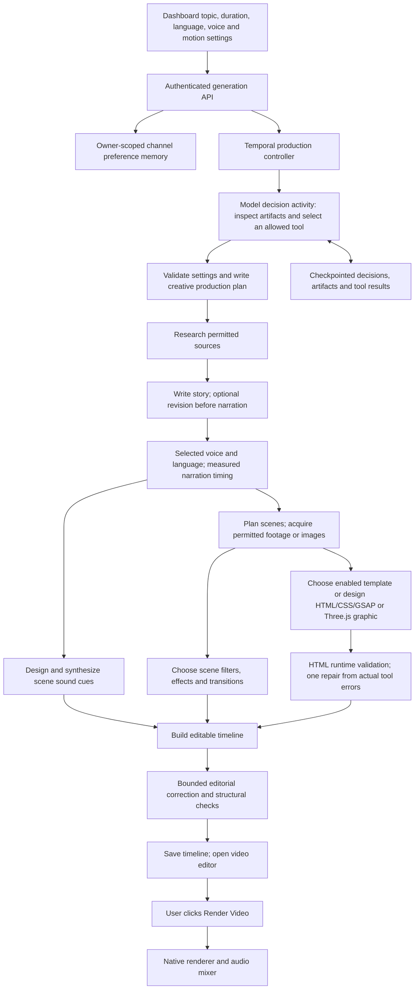

# Main video production agent

The main agent turns a topic and channel settings into an editable video timeline. The editor agent is a separate concern. Final MP4 export remains an explicit user action.

## Agent and execution boundary

`choose_production_tool` receives the current request, saved preferences, completed tool results and available research/script/scene/timeline artifacts. It chooses among tools whose prerequisites are complete. A single available tool executes directly. Creative choices use the configured production model. Temporal executes the chosen activity, records its result and repeats until a validated timeline is saved. Decisions have a finite budget; activity failures use Temporal retry policies. Unsupported tool names and invalid tool arguments fail validation.

This is one production agent using tools, rather than separate research, writing and audio agents. Development helpers used to implement the code are not product agents. The development model selected in Codex does not change the application's production provider.

## User settings

Current settings override historical preferences. Narration uses the selected voice and language. Captions may retain that language's words in Latin spelling. Measured TTS duration drives scene timing; the requested duration is a generation target rather than an exact audio guarantee.

Motion modes are `selected`, `auto`, `custom` and `none`. Selected mode uses only enabled approved templates. Auto may choose approved templates or original graphics. Custom permits original scene graphics. None suppresses motion graphics. Source permissions, effect disable flags and transition blocklists remain authoritative.

## Timing, visuals and audio

Scene acquisition and sound design can run concurrently after narration. Asset fetching uses bounded concurrency and checkpoints. Original graphic generation follows scene planning. Typed visual decisions use the existing editor/renderer filter and effect catalogs. Transitions apply at final scene boundaries, after template splitting, and skip blocked types and internal splits of the same scene.

Duration extensions add researched body sections before the existing ending. Explicit story roles preserve this ordering, including on cached-script retries. Narration segment metadata and WAV concatenation use the same reordered section IDs, so captions, scene timing and audio remain aligned.

Short narration top-ups use the measured remaining gap and the selected voice's observed character rate, without a fixed ninety-second padding. The approved dashboard length overrides older duration hints in prompt text. Original graphic creation and visual grading may run concurrently once the agent chooses original motion, or custom mode requires it. Caption spelling conversions are checkpointed per section; retries reuse completed conversions. Provider retry delays respect bounded advertised cooldowns.

HTML graphics have a seekable paused GSAP timeline. The renderer compiles each newly generated HTML graphic, checks readiness and errors, and seeks/paints its start, midpoint and end. A failed runtime check feeds the actual error back into one bounded repair; a second failure prevents delivery. Design drafts survive renderer unavailability so retries do not pay to regenerate a completed design. Complete JavaScript factory expressions are normalized to the renderer's function-body contract. Each new response contains one compact original scene design to fit the provider's token ceiling.

Three.js graphics use the existing validated scene specification and renderer. Template fields are bound to the current scene. Scene-specific sound cues and the background music bed use separate levels; changing music does not overwrite SFX gain. The final timeline retains native clip, caption, transition, motion and audio records that the editor can modify.

## Persistence and recovery

Owner and channel identifiers scope preference memory. Only explicit settings enter this memory; generated factual claims are not treated as user preferences. Project/run artifacts store research, script, narration, scenes, creative plan, visual plan, sound plan, generated graphics, decision history and timeline. Checkpoints reuse completed provider work on retries, including narration, scene assets, creative decisions and production scripts.

## Quality checks and present limits

Structural inspection checks finite positive timing, unique clip identifiers, scene coverage, overlap, audio levels and transition references. The editorial review can make a limited set of validated timeline corrections. HTML runtime checks exercise actual browser rendering, but do not judge image meaning or audio quality. Tool results explicitly report that frames and audio have not been inspected by the model. This implementation does not yet provide an autonomous audiovisual critique-and-repair loop. Source relevance, factual completeness and creative quality still require preview review; automated checks do not guarantee a perfect video.

Generation produces the timeline without starting the final render workflow. QA may create a short internal preview to verify a generated graphic; that is separate from the user's final export.

### Scene tool integration follow-up

Visual decisions support per-scene motion, direction, factual text labels, and optional still-subject extraction. Labels remain within clip bounds and respect disabled overlays/animations. Subject extraction uses an internal authenticated API, project-scoped assets and cached transparent copies; original media remains unchanged. Video background segmentation is not implemented. Cutout failures are recorded and retain the original source.

HTML export preserves an explicit template subject and extracts a poster from legacy video sources even when the composition is labeled as an image. Regression tests cover both paths. These checks do not establish semantic audiovisual quality; live final export and playback review remain separate validation steps.
