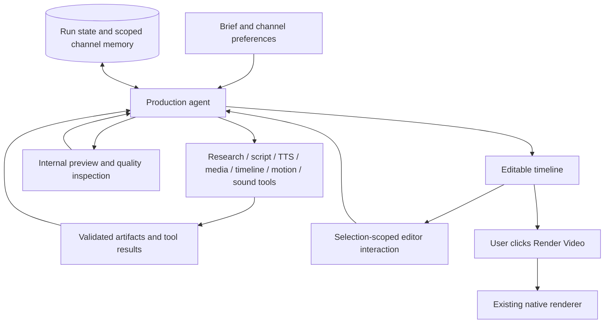

# One production agent: implementation plan

The product has one production agent. Research, writing, narration, sourcing,
motion graphics and sound are tools, not separately deployed autonomous agents.
The existing Temporal generation workflow and interactive editor planner remain
the starting point. Final export starts only when the user clicks Render Video.

## Target execution model

## Increment now implemented

An opt-in production director runs inside timeline construction before the
manifest is saved. It observes narration and timeline metadata, chooses a
validated edit, receives the result and chooses again, at most three decisions.
Available tools adjust B-roll timing inside its narration scene, remove a B-roll
clip, or change music level. Each edit is transactional and cannot execute code,
change narration or invent assets. Music levels update both manifest consumers.
The existing renderer already applies sidechain ducking under narration.

Decisions are content-addressed within the project/run. Activity retries reuse
decisions for identical inputs. A director-state artifact records preference
snapshot, tool results, structural timing findings and completion/budget status.
This is durable run memory, not learned cross-project preference memory.
The default setting remains off until representative provider/media evaluations
validate the new path. Enable with PRODUCTION_DIRECTOR_ENABLED=true.

The implemented inspection is structural only: it does not watch or listen to
the preview. No claim of visual quality evaluation is implied by completion.

## Next increments, in dependency order

1. Expose existing generation stages as typed, idempotent tools with explicit
   artifact dependencies and bounded retries. Move stage choice into one
   director decision activity while Temporal persists execution and recovery.
   Use workflow versioning for replay-safe rollout to existing runs.
2. Persist channel preferences through the authenticated profile store; record
   user-accepted editorial feedback separately from per-run scratch state.
   Retrieve by owner/channel and never learn from unapproved generated claims.
3. Add media observation tools (sampled frames, transcripts, source metadata),
   actual source verification and scene-coverage checks. Rank clips from this
   evidence rather than treating metadata matches as visual understanding.
4. Expose existing uploaded HTML/CSS/GSAP template adaptation, text placement,
   music and cue libraries through validated tool contracts. Preserve timing,
   source trims, language and caption clocks; reuse existing rendering code.
5. Render internal preview samples, measure audio and inspect sampled visual
   frames. Feed concrete findings into bounded revision cycles. Cache media and
   previews by full content fingerprints; parallelize independent sourcing/TTS
   work within current provider concurrency limits.
6. Enforce editor selection scope on the server and executor: only selected
   clip and directly linked assets may change; preserve other clips, provide
   undo and validate the entire proposed transaction before applying it.
7. Add per-run cost/time/tool budgets and user-visible progress/tool evidence;
   benchmark representative short and long videos before enabling by default.

## Completion evidence required

Provider-backed run demonstrating plan -> tool result -> revised decision;
restart/resume with no duplicate paid work; isolated channel memory tests;
selected-clip edit preserving all unrelated clips; preview-driven correction;
actual final export after an explicit user request. The present increment does
not satisfy all these gates and is not a completed advanced-production system.
